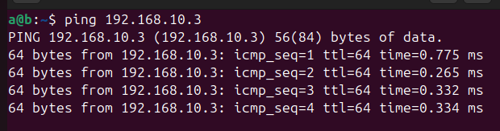

# Лабораторная работа 2

## Цель
Изучение основ настройки виртуальных машин и сетевых соединений между ними с использованием VirtualBox.

## Задачи

1. Создать, настроить виртуальную машину А, обеспечить ей доступ в Интернет.
2. Создать, настроить виртуальную машину Б, обеспечить сетевой досутп из машины А в машину Б.
3. Создать, настроить виртуальную машину В, обеспечить сетевой доступ из машины А в машину В так, запретить доступ из машины Б в машину В.
4. Проверить доступ.

## Основная часть

Создал первую виртуальную машину А. 
Доступ в интернет был обеспечен автоматически с помощью NAT (1 адаптер). Проверить доступ можно с помощью команды `ping`.


Далее создал клонов машины А — машины B и C.

На каждой из них сменил имя хоста с помощью команды `hostnamectl set-hostname` на b и c соответсвенно.

В VirtualBox в Инструменты-Сеть-Сети NAT создал новую сеть:


В каждой машине включаем Адаптер 2-Внутренняя сеть, выбираем созданную раннее сеть `in`

После настраиваем статические IP-адреса на каждой машине командой:

`sudo ifconfig esn0p8 192.168.10.{n} netmask 255.255.255.0 up`

Для A, B, C n равно 1, 2, 3 соответственно.

*P.S. для работы `ifconfig` требуется наличие пакета `net-tools`*

Проверка подключения:

```На машине A:
ping 192.168.10.2  # Проверка соединения с машиной B
ping 192.168.10.3  # Проверка соединения с машиной C
```


На машине B:

```
ping 192.168.10.3  # Проверка соединения с машиной C
```




На машине C:

```
ping 192.168.10.2  # Проверка соединения с машиной B
```


Настроил `iptables` для блокировки доступа на машине C, чтобы блокировать доступ от машины B:
```
sudo iptables -A INPUT -s 192.168.10.2 -j DROP
```

Итог с машины B:


## Вывод

В ходе лабораторной работы были успешно настроены виртуальные машины в VirtualBox, обеспечен их доступ в Интернет и организовано сетевое взаимодействие между ними с применением правил доступа.